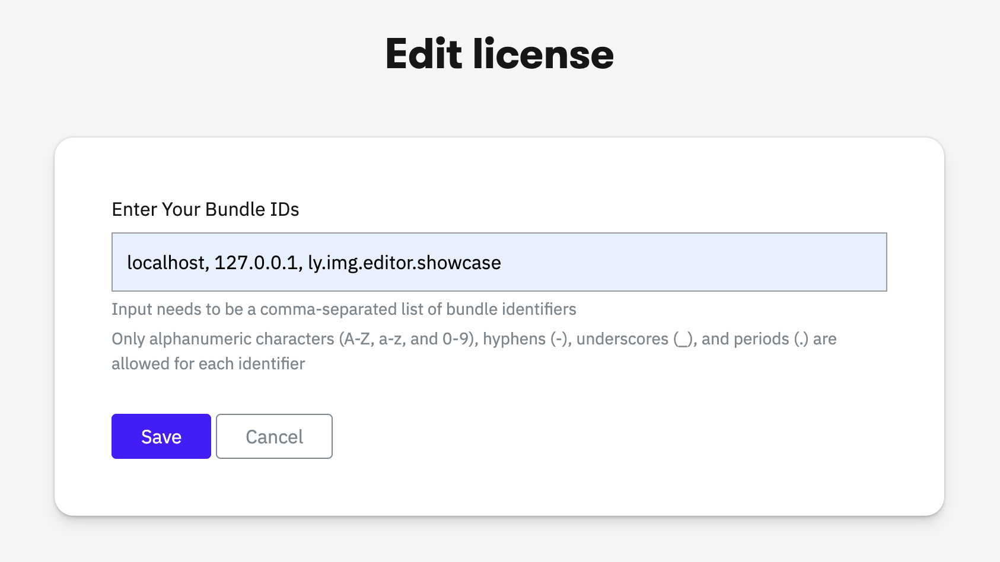

# IMGLY Creative Engine - Android Examples, Mobile Editor

This repository contains the Android examples for the IMG.LY `Engine`, the core of CE.SDK, as well as the source code of our mobile editor solutions.
The `Engine` enables you to build any design editing UI, automation and creative workflow in Kotlin.
It offers performant and robust graphics processing capabilities combining the best of layout, typography and image processing with advanced workflows centered around templating and adaptation.

The `Engine` seamlessly integrates into any Android app whether you are building a photo editor, template-based design tool or scalable automation of content creation for your app.
The mobile editor is fully built on top of the `Engine`.

## Documentation

The full documentation of the engine can be found at [here](https://img.ly/docs/cesdk/engine/quickstart?platform=android).
There you will learn what configuration options are available and find a list and description of all API methods.

The full documentation of the mobile editor can be found at [here](https://img.ly/docs/cesdk/mobile-editor/quickstart?platform=android), where you can learn about:
1. How to integrate the mobile editor as a dependency
2. List of available solutions
3. Various configuration options

## License

The `Engine` is a commercial product. To use it you need to unlock the SDK with a license file. You can purchase a license at https://img.ly/pricing.

In order to run the `Showcases` application that lives in the `app` module of this repository use the instructions below:
1. Get a free trial license at https://img.ly/forms/free-trial. Note that the license is tied to the application id of the application. Since the application id of the `Showcases` app is `ly.img.editor.showcase`, you should include it in the list of bundle ids.
   
2. Copy the license string.
3. Include the license string in the `local.properties` file:
```
license=...
```

Note that failing to provide the license key-value pairing will display an error when opening any of the showcases.
